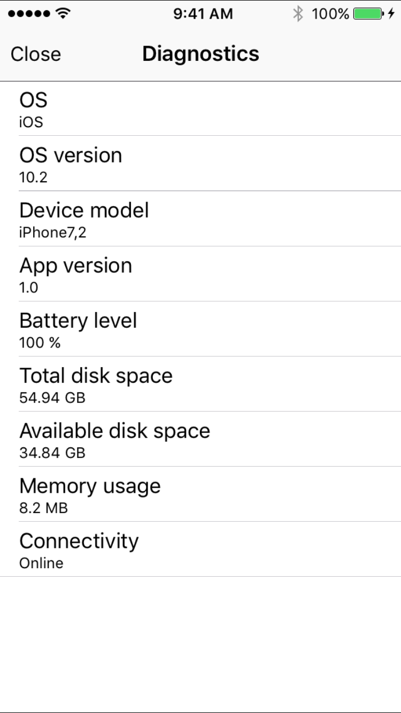

# MRGDiagnostics
[](https://travis-ci.org/mirego/MRGDiagnostics)

An iOS Framework that offers you an easy way to add a diagnostics view to your project.

## Requirements

- iOS 8.0+
- Xcode 8.2.1
- Swift 3.0

## Installation

You can use [Carthage](github.com/carthage/carthage) to install `MRGDiagnostics` by adding it to your `Cartfile`:

```
github "mirego/mrgdiagnostics"
```

### CocoaPods
You can use [CocoaPods](http://cocoapods.org/) to install `MRGDiagnostics` by adding it to your `Podfile`:

```ruby
platform :ios, '8.0'
use_frameworks!
pod 'MRGDiagnostics', :git => 'https://github.com/mirego/MRGDiagnostics.git'
```

### Manually

1. Download and drop the Swift file you need in your project.  
2. Congratulations!

## Usage example

```swift
import MRGDiagnostics

let vc = MRGDiagnosticsViewController()
```

## Screenshot



## License

MRGDiagnostics is © 2017 [Mirego](http://www.mirego.com) and may be freely
distributed under the [New BSD license](http://opensource.org/licenses/BSD-3-Clause).
See the [`LICENSE.md`](https://github.com/mirego/MRGDiagnostics/blob/master/LICENSE.md) file.

## About Mirego

[Mirego](http://mirego.com) is a team of passionate people who believe that work is a place where you can innovate and have fun. We're a team of [talented people](http://life.mirego.com) who imagine and build beautiful Web and mobile applications. We come together to share ideas and [change the world](http://mirego.org).

We also [love open-source software](http://open.mirego.com) and we try to give back to the community as much as we can.
